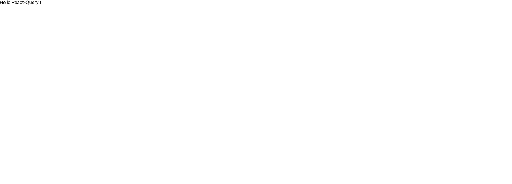

# 1. 프로젝트 설정

## Create-React-App

타입스크립트 템플릿을 사용하는 [리액트 어플리케이션을 생성](https://create-react-app.dev/docs/getting-started#creating-a-typescript-app)합니다.

```
$ npx create-react-app pokedex --template typescript
```

해당 프로젝트로 이동해서 프로젝트에 필요한 라이브러리를 설치합니다.

```
$ cd pokedex
$ npm i @emotion/react @emotion/styled axios react-query reset-css throttle-debounce react-router-dom
$ npm i @types/react-router-dom @types/throttle-debounce -D
```

아래의 불필요한 파일들을 제거하고, `/src/App.tsx` 을 아래와 작성한 후 `npm run start` 로 프로젝트가 정상적으로 구동되는지 확인합니다.

* `/src/App.css`
* `/src/App.test.tsx`
* `/src/index.css`
* `/src/logo.svg`

```jsx
import React from 'react';

function App() {
  return (
    <div>
      Hello React-Query !
    </div>
  );
}

export default App;
```



