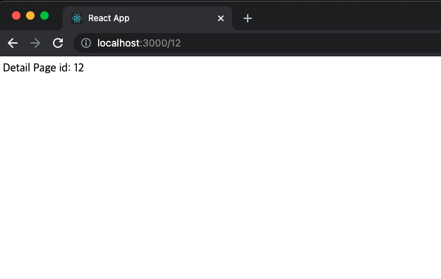

# 3. 라우터

## 페이지 만들기

`/src` 폴더 하위에 `/src/pages` 폴더를 생성합니다.

`IndexPage.tsx`, `DetailPage.tsx`  페이지 컴포넌트를 `/src/pages` 하위에 생성합니다.

* `IndexPage.tsx` : 포켓몬 목록을 표시합니다.
* `DetailPage.tsx` : 포켓몬의 id 를 파라미터로 전달받아 선택한 포켓몬의 상세 정보를 표시합니다.

### src/pages/IndexPage.tsx

```jsx
import React from 'react';

const IndexPage: React.FC = () => (
  <div>Index Page</div>
)

export default IndexPage;

```

### src/pages/DetailPage.tsx

```jsx
import React from 'react';
import { useParams } from 'react-router-dom';

type Params = {
  id: string;
}

const DetailPage: React.FC = () => {
  const {id} = useParams<Params>();
  
  return (
    <div>Detail Page id: {id}</div>
  )
}

export default DetailPage;
```


## 라우터 설정

### src/App.tsx

```jsx
import React from 'react';
import { BrowserRouter as Router, Route, Switch } from 'react-router-dom';

import IndexPage from './pages/IndexPage';
import DetailPage from './pages/DetailPage';

function App() {
  return (
    <Router>
      <Switch>
        <Route exact path="/" component={IndexPage} />
        <Route path="/:id" component={DetailPage} />
      </Switch>
    </Router>
  );
}

export default App;
```




