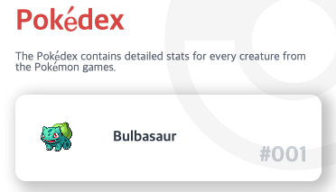

# 6-1. 컴포넌트 스타일링

## src/components/PoketmonList.tsx

```jsx
import React from 'react';
import styled from '@emotion/styled/macro';

const Base = styled.div`
  margin-top: 24px;
`;

const ListItem = styled.li`
  position: relative;
  list-style: none;
  display: flex;
  align-items: center;
  box-shadow: 6px 4px 14px 5px rgba(0,0,0,0.21);
  border-radius: 12px;
  & + & {
    margin-top: 18px;
  }
`;

const List = styled.ul`
  margin: 0;
  padding: 0;
 `;

const Image = styled.img``;

const Name = styled.p`
  margin: 0;
  padding: 0 0 0 12px;
  flex: 1 1 100%;
  color: #374151;
  text-transform: capitalize;
  font-size: 16px;
  font-weight: bold;
`;

const Index = styled.p`
  position: absolute;
  margin: 0;
  padding: 0;
  right: 16px;
  bottom: 16px;
  font-size: 24px;
  font-weight: bold;
  color: #D1D5DB;
`;

const getImageUrl = (pokemonIndex: number): string =>
  `https://raw.githubusercontent.com/PokeAPI/sprites/master/sprites/pokemon/${pokemonIndex}.png`

const formatNumbering = (pokemonIndex: number | string): string =>
  `#${(typeof pokemonIndex === 'number' ? String(pokemonIndex) : pokemonIndex).padStart(3, '0')}`

const PokemonList: React.FC = () => {
  return (
    <Base>
      <List>
        <ListItem>
          <Image src={getImageUrl(1)} alt="bulbasaur" />
          <Name>bulbasaur</Name>
          <Index>{formatNumbering(1)}</Index>
        </ListItem>
      </List>
    </Base>
  )
}

export default PokemonList;
```


## src/pages/IndexPage.tsx

```jsx
import React from 'react';
import styled from '@emotion/styled/macro';

import PokemonList from '../components/PokemonList';

const Container = styled.div`
  padding: 12px 18px;
  overflow: hidden;
`;

const Title = styled.h1`
  margin: 0;
  padding: 0;
  color: #d34f49;
  font-weight: bold;
`;

const Description = styled.small`
  color: #6B7280;
  padding: 0;
  margin: 16px 0 0 0;
  display: block;
`;

const ImageWrapper = styled.div`
  position: fixed;
  width: 288px;
  height: 288px;
  top: 0;
  right: 0;
  opacity: 0.4;
  transform: translate(96px, -96px);
`;

const Image = styled.img`
  width: 100%;
  height: 100%;
  object-fit: contain;
`;

const IndexPage: React.FC = () => (
  <Container>
    <Title>Pokédex</Title>
    <Description>The Pokédex contains detailed stats for every creature from the Pokémon games.</Description>
    <PokemonList />
    <ImageWrapper>
      <Image src="/assets/pocketball.svg" />
    </ImageWrapper>
  </Container>
)

export default IndexPage;
```



