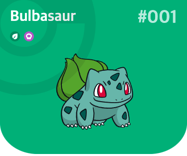
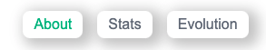
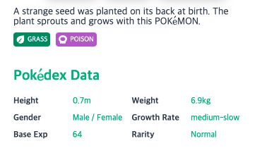
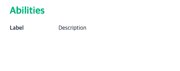
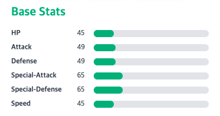
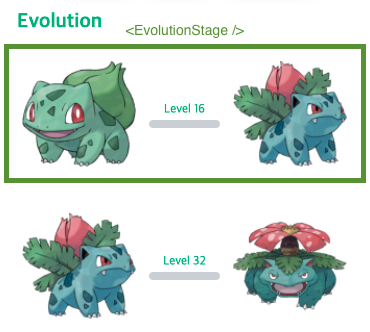

# 7-1. 컴포넌트 스타일링

## src/utils/index.ts

```typescript
export const mapColorToHex = (color?: string) => { // 포켓몬의 컬러를 받아 hexCode 로 변
  switch (color) {
    case 'white':
    case 'gray':
      return '#6B7280';
    case 'brown': return '#92400E';
    case 'yellow': return '#F59E0B';
    case 'green': return '#10B981';
    case 'red': return '#EF4444';
    case 'blue': return '#3B82F6';
    case 'purple': return '#8B5CF6';
    case 'pink': return '#EC4899';
    case 'black': return '#1F2937';
    default: return '#6B7280';
  }
}

export const mapTypeToHex = (type?: string) => { // 포켓몬의 타입를 받아 hexCode 로 변
  switch (type) {
    case 'bug': return '#92BC2C';
    case 'dark': return '#595761';
    case 'dragon': return '#0C69C8';
    case 'electric': return '#F2D94E';
    case 'fire': return '#FBA54C';
    case 'fairy': return '#EE90E6';
    case 'fighting': return '#D3425F';
    case 'flying': return '#A1BBEC';
    case 'ghost': return '#5F6DBC';
    case 'grass': return 'rgba(5, 150, 105, 1)';
    case 'ground': return '#DA7C4D';
    case 'ice': return '#75D0C1';
    case 'normal': return '#A0A29F';
    case 'poison': return '#B763CF';
    case 'psychic': return '#FA8581';
    case 'rock': return '#C9BB8A';
    case 'steel': return '#5695A3';
    case 'water': return '#539DDF';
    default: return '#6B7280';
  }
}

export const formatNumbering = (pokemonIndex: number | string): string => // 포켓몬의 인덱스를 받아서 #001 형태로 변
  `#${(typeof pokemonIndex === 'number' ? String(pokemonIndex) : pokemonIndex).padStart(3, '0')}`
```

## src/components/PoketmonInfo.tsx

```jsx
import React from 'react';
import styled from '@emotion/styled/macro';

import { Color, Type } from '../types';
import { formatNumbering, mapColorToHex, mapTypeToHex } from '../utils';

type Props = {
  id: string;
  name?: string;
  types?: Array<Type>;
  color?: Color;
}

const Base = styled.div<{ color?: string }>`
  display: flex;
  flex-direction: column;
  background-color: ${({ color }) => color};
  padding: 20px;
  border-bottom-left-radius: 20%;
  border-bottom-right-radius: 20%;
`;

const ThumbnailImageWrapper = styled.div`
  width: 160px;
  margin-inline: auto;
  margin-block: 24px;
`;

const ThumbnailImage = styled.img`
  width: 100%;
  height: 100%;
  object-fit: contain;
`;

const InfoWrapper = styled.div`
  display: flex;
  justify-content: space-between;
  width: 100%;
`;

const Name = styled.div`
  color: #fff;
  font-size: 30px;
  font-weight: bold;
  text-transform: capitalize;
`;

const Index = styled.div`
  color: #fff;
  font-size: 36px;
  font-weight: bold;
  opacity: 0.75;
`;

const TypeWrapper = styled.div<{ color: string }>`
  background-color: ${({ color }) => color};
  padding: 4px;
  border-radius: 50%;
  display: flex;
  justify-content: center;
  align-items: center;
`;

const TypeList = styled.div`
  display: flex;
  margin-top: 8px;
  ${TypeWrapper} + ${TypeWrapper} {
    margin-left: 8px;
  }
`;

const TypeInfo = styled.img`
  height: 12px;
`;

const ImageWrapper = styled.div`
  position: absolute;
  width: 288px;
  height: 288px;
  left: -96px;
  top: -96px;
  opacity: 0.75;
`;

const Image = styled.img`
  width: 100%;
  height: 100%;
  object-fit: contain;
`;

const PokemonInfo: React.FC<Props> = ({ id, name, color, types }) => (
  <Base color={mapColorToHex(color?.name)}>
    <ImageWrapper>
      <Image src="/assets/pocketball.svg" />
    </ImageWrapper>
    <InfoWrapper>
      <Name>
        {name}
      </Name>
      <Index>
        {formatNumbering(id)}
      </Index>
    </InfoWrapper>
    <TypeList>
      {
        types?.map(({ type }, idx) => (
          <TypeWrapper key={idx} color={mapTypeToHex(type.name)}>
            <TypeInfo src={`/assets/${type.name}.svg`} />
          </TypeWrapper>
        ))
      }
    </TypeList>
    <ThumbnailImageWrapper>
      <ThumbnailImage src={`https://raw.githubusercontent.com/PokeAPI/sprites/master/sprites/pokemon/other/dream-world/${id}.svg`} alt="image" />
    </ThumbnailImageWrapper>
  </Base>
)

export default PokemonInfo;
```



## src/components/Tabs.tsx

```jsx
import React from 'react';
import styled from '@emotion/styled/macro';

import { Color } from '../types';
import { mapColorToHex } from '../utils';

type Props = {
  tab: 'about' | 'stats' | 'evolution';
  onClick: (tab: 'about' | 'stats' | 'evolution') => void;
  color?: Color;
}

const List = styled.ul`
  list-style: none;
  margin: 0;
  padding: 0;
  display: flex;
`;

const ListItem = styled.li`
  & + & {
    margin-left: 16px;
  }
`;

const TabButton = styled.button<{ active?: boolean; color: string; }>`
  margin: 0;
  border-radius: 8px;
  box-shadow: 6px 4px 14px 5px rgba(0,0,0,0.21);
  padding: 6px 12px;
  background-color: #fff;
  border: none;
  font-size: 16px;
  color: ${({ active, color }) => active ? color : '#6B7280'};
`;

const Tabs: React.FC<Props> = ({ tab, onClick, color }) => (
  <List>
    <ListItem onClick={() => onClick('about')}>
      <TabButton active={tab === 'about'} color={mapColorToHex(color?.name)}>About</TabButton>
    </ListItem>
    <ListItem onClick={() => onClick('stats')}>
      <TabButton active={tab === 'stats'} color={mapColorToHex(color?.name)}>Stats</TabButton>
    </ListItem>
    <ListItem onClick={() => onClick('evolution')}>
      <TabButton active={tab === 'evolution'} color={mapColorToHex(color?.name)}>Evolution</TabButton>
    </ListItem>
  </List>
)

export default Tabs;
```



## src/components/About.tsx

```jsx
import React from 'react';
import styled from "@emotion/styled/macro";

import { Ability, Color, Type } from '../types';
import Abilities from './Abilities';
import { mapColorToHex, mapTypeToHex } from '../utils';

type Props = {
  isLoading: boolean;
  color?: Color;
  growthRate?: string;
  flavorText?: string;
  genderRate?: number;
  isLegendary?: boolean;
  isMythical?: boolean;
  types?: Array<Type>;
  weight?: number;
  height?: number;
  baseExp?: number;
  abilities?: Array<Ability>;
}

const Base = styled.article`
  padding: 20px;
`;

const FlavorText = styled.p`
  margin: 0 auto;
  word-break: break-word;
  font-size: 14px;
  color: #374151;
`;

const TypeWrapper = styled.div<{ color: string }>`
  background-color: ${({ color }) => color};
  padding: 4px;
  display: flex;
  justify-content: center;
  align-items: center;
  border-radius: 4px;
`;

const TypeList = styled.div`
  display: flex;
  margin-top: 8px;
  ${TypeWrapper} + ${TypeWrapper} {
    margin-left: 8px;
  }
`;

const TypeImage = styled.img`
  height: 12px;
`;

const TypeLabel = styled.span`
  margin-left: 4px;
  color: #fff;
  font-size: 10px;
`;

const ImageWrapper = styled.div`
  width: 100%;
  height: 160px;
  display: flex;
  justify-content: center;
  align-items: center;
`;

const Image = styled.img`
  width: 120px;
  height: 120px;
  object-fit: contain;
`;


const InfoContainerWrapper = styled.div`
  margin-top: 32px;
`;

const Title = styled.h4<{ color: string }>`
  margin: 0;
  padding: 0;
  font-size: 20px;
  font-weight: bold;
  color: ${({ color }) => color};
`;

const InfoContainer = styled.div`
  display: grid;
  grid-template-columns: repeat(2, 1fr);
  margin-top: 20px;
  row-gap: 12px;
`;

const InfoItem = styled.div`
  display: grid;
  grid-template-columns: repeat(2, minmax(0, 1fr));
`;

const InfoItemLabel = styled.span`
  font-weight: bold;
  color: #374151;
  font-size: 12px;
`;

const InfoItemValue = styled.span<{ color: string }>`
  color: ${({ color }) => color};
  font-size: 12px;
`;

const About: React.FC<Props> = ({
  isLoading,
  isMythical,
  isLegendary,
  types,
  weight,
  flavorText,
  growthRate,
  genderRate,
  color,
  height,
  baseExp,
  abilities,
  }) => {
  const rarity = isLegendary ? 'Legendary' : isMythical ? 'Mythical' : 'Normal';

  return (
    <Base>
      <FlavorText>{flavorText}</FlavorText>
      {
        isLoading ? (
          <ImageWrapper>
            <Image src="/loading.gif" />
          </ImageWrapper>
        ) : (
          <>
            <TypeList>
              {
                types?.map(({ type }, idx) => (
                  <TypeWrapper key={idx} color={mapTypeToHex(type.name)}>
                    <TypeImage src={`/assets/${type.name}.svg`} />
                    <TypeLabel>{type.name.toUpperCase()}</TypeLabel>
                  </TypeWrapper>
                ))
              }
            </TypeList>
            <InfoContainerWrapper>
              <Title color={mapColorToHex(color?.name)}>Pokédex Data</Title>
              <InfoContainer>
                <InfoItem>
                  <InfoItemLabel>Height</InfoItemLabel>
                  {height && <InfoItemValue color={mapColorToHex(color?.name)}>{height / 10}m</InfoItemValue>}
                </InfoItem>
                <InfoItem>
                  <InfoItemLabel>Weight</InfoItemLabel>
                  {weight && <InfoItemValue color={mapColorToHex(color?.name)}>{weight / 10}kg</InfoItemValue>}
                </InfoItem>
                <InfoItem>
                  <InfoItemLabel>Gender</InfoItemLabel>
                  {genderRate && <InfoItemValue color={mapColorToHex(color?.name)}>{genderRate === -1 ? 'Unknown' : 'Male / Female'}</InfoItemValue>}
                </InfoItem>
                <InfoItem>
                  <InfoItemLabel>Growth Rate</InfoItemLabel>
                  {growthRate && <InfoItemValue color={mapColorToHex(color?.name)}>{growthRate}</InfoItemValue>}
                </InfoItem>
                <InfoItem>
                  <InfoItemLabel>Base Exp</InfoItemLabel>
                  {baseExp && <InfoItemValue color={mapColorToHex(color?.name)}>{baseExp}</InfoItemValue>}
                </InfoItem>
                <InfoItem>
                  <InfoItemLabel>Rarity</InfoItemLabel>
                  {rarity && <InfoItemValue color={mapColorToHex(color?.name)}>{rarity}</InfoItemValue>}
                </InfoItem>
              </InfoContainer>
            </InfoContainerWrapper>
            {abilities && <Abilities abilities={abilities} color={color} />}
          </>
        )
      }
    </Base>
  )
}

export default React.memo(About);
```



## src/components/Abilities.tsx

```jsx
import React from 'react';
import styled from '@emotion/styled/macro';

import { Ability, Color, EffectEntry } from '../types';
import { mapColorToHex } from '../utils';

interface Props {
  color?: Color;
}

const Title = styled.h4<{ color: string }>`
  margin: 0;
  padding: 0;
  font-size: 20px;
  font-weight: bold;
  color: ${({ color }) => color};
`;

const Base = styled.div`
  margin-top: 32px;
`;

const ListItem = styled.li`
  display: flex;
`;

const List = styled.ul`
  margin: 20px 0 0 0;
  padding: 0;
  list-style: none;
  ${ListItem} + ${ListItem} {
    margin-top: 12px;
  }
`;

const Label = styled.span`
  flex: 1 0 30%;
  text-transform: capitalize;
  color: #374151;
  font-size: 12px;
  font-weight: bold;
`;

const Description = styled.span`
  flex: 1 0 70%;
  font-weight: 400;
  font-size: 12px;
  color: #374151;
  word-wrap: break-word;
`;

const Abilities: React.FC<Props> = ({ color }) => {
  return (
    <Base>
      <Title color={mapColorToHex(color?.name)}>Abilities</Title>
      <List>
        <ListItem>
          <Label>Label</Label>
          <Description>Description</Description>
        </ListItem>
      </List>
    </Base>
  )
}

export default Abilities;
```



## src/components/Stats.tsx

```jsx
import React from 'react';
import styled from '@emotion/styled/macro';

import { Color, Stat } from '../types';
import { mapColorToHex } from '../utils';

type Props = {
  isLoading: boolean;
  stats?: Array<Stat>;
  color?: Color;
}

const Base = styled.div`
  margin-top: 32px;
  padding: 0 20px 20px;
`;

const Title = styled.h4<{ color: string }>`
  margin: 0;
  padding: 0;
  font-size: 20px;
  font-weight: bold;
  color: ${({ color }) => color};
`;

const List = styled.ul`
  margin: 20px 0 0 0;
  padding: 0;
  list-style: none;
`;

const ListItem = styled.li`
  display: grid;
  grid-template-columns: repeat(12, minmax(0, 1fr));
  & + & {
    margin-top: 12px;
  }
`;

const Name = styled.div`
  grid-column: span 4 / span 4;
  color: #374151;
  font-weight: bold;
  text-transform: capitalize;
  font-size: 12px;
`;

const Amount = styled.div`
  grid-column: span 1 / span 1;
  font-size: 12px;
  color: #374151;
`;

const GaugeWrapper = styled.div`
  grid-column: span 7 / span 7;
  border-radius: 12px;
  background-color: #e5e7eb;
`;

const Gauge = styled.div<{ percentage: number; color: string; }>`
  background-color: ${({ color }) => color};
  width: ${({ percentage }) => `${percentage}%`};
  height: 100%;
  border-radius: 12px;
`;

const Stats: React.FC<Props> = ({ stats, color }) => (
  <Base>
    <Title color={mapColorToHex(color?.name)}>Base Stats</Title>
    <List>
      {
        stats?.map(({ stat, base_stat }, idx) => (
          <ListItem key={idx}>
            <Name>{stat.name === 'hp' ? stat.name.toUpperCase() : stat.name}</Name>
            <Amount>{base_stat}</Amount>
            <GaugeWrapper>
              <Gauge percentage={(base_stat / 255) * 100} color={mapColorToHex(color?.name)} />
            </GaugeWrapper>
          </ListItem>
        ))
      }
    </List>
  </Base>
)

export default Stats;
```



## src/components/Evolution.tsx

```jsx
import React, { useEffect, useState } from 'react';
import styled from '@emotion/styled/macro';

import { Chain, Color } from '../types';
import EvolutionStage from './EvolutionStage';
import { mapColorToHex } from '../utils';

type Props = {
  isLoading: boolean;
  id?: string;
  color?: Color;
  url?: string;
}

const Base = styled.div`
  margin-top: 32px;
  padding: 0 20px 20px;
`;

const Title = styled.h4<{ color: string }>`
  margin: 0;
  padding: 0;
  font-size: 20px;
  font-weight: bold;
  color: ${({ color }) => color};
`;

const ImageWrapper = styled.div`
  width: 100%;
  height: 160px;
  display: flex;
  justify-content: center;
  align-items: center;
`;

const Image = styled.img`
  width: 120px;
  height: 120px;
  object-fit: contain;
`;

const List = styled.ul`
  list-style: none;
  margin: 20px 0 0 0;
  padding: 0;
  > li + li {
    margin-top: 24px;
  }
`;

const EmptyWrapper = styled.div`
  display: flex;
  justify-content: center;
  align-items: center;
  width: 100%;
  height: calc(100vh - 444px);
`;

const Empty = styled.div<{ color: string }>`
  color: ${({ color }) => color};
`;

const Evolution: React.FC<Props> = ({ url, color }) => {
  const [evolutionChain, setEvolutionChain] = useState<Array<{ from: { name: string; url: string }, to: { name: string; url: string }, level: number }>>([]);

  useEffect(() => {
    const makeEvolutionChain = (chain: Chain) => {
      if (chain.evolves_to.length) {
        const [evolvesTo] = chain.evolves_to;

        const from = chain.species;
        const to = evolvesTo.species;
        const level = evolvesTo.evolution_details[0].min_level;

        setEvolutionChain(prev => [...prev, { from, to, level }]);

        makeEvolutionChain(chain.evolves_to[0]);
      }
    }

    isSuccess && data && makeEvolutionChain(data.data.chain);

    return (): void => {
      setEvolutionChain([]);
    }
  }, [isSuccess, data]);

  return (
    <Base>
      <Title color={mapColorToHex(color?.name)}>Evolution</Title>
      {
        isLoading || isError ? (
          <ImageWrapper>
            <Image src="/loading.gif" />
          </ImageWrapper>
        ) : (
          evolutionChain.length ? (
            <List>
              {
                evolutionChain.map(({ from, to, level }, idx) => (
                  <EvolutionStage key={idx} from={from} to={to} level={level} color={color} />
                ))
              }
            </List>
          ) : (
            <EmptyWrapper>
              <Empty color={mapColorToHex(color?.name)}>This Pokémon does not evolve.</Empty>
            </EmptyWrapper>
          )
        )
      }
    </Base>
  )
}

export default Evolution;
```



## src/components/EvolutionStage.tsx

```jsx
import React from 'react';
import styled from '@emotion/styled/macro';

import { Color } from '../types';
import { mapColorToHex } from '../utils';

interface Props {
  level: number;
  color?: Color;
}

const DividerWrapper = styled.div`
  display: flex;
  flex-direction: column;
  width: 100%;
`;

const Text = styled.div<{ color: string }>`
  text-align: center;
  color: ${({ color }) => color};
  font-size: 12px;
`;

const Divider = styled.div`
  background-color: #D1D5DB;
  border-radius: 12px;
  height: 8px;
  margin-inline: 8px;
  margin-top: 4px;
`;

const ImageWrapper = styled.div`
`;

const Image = styled.img`
  width: 100%;
  height: 100%;
  object-fit: contain;
`;

const Base = styled.li`
  width: 100%;
  display: flex;
  justify-content: center;
  align-items: center;
`;

const EvolutionStage: React.FC<Props> = ({ level, color }) => (
  <Base>
    <ImageWrapper>
      <Image src={''} />
    </ImageWrapper>
    <DividerWrapper>
      {level && <Text color={mapColorToHex(color?.name)}>{`Level ${level}`}</Text>}
      <Divider />
    </DividerWrapper>
    <ImageWrapper>
      <Image src={''} />
    </ImageWrapper>
  </Base>
  );

export default EvolutionStage;
```

