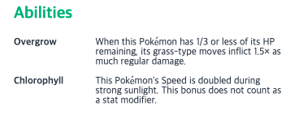

# 7-2-2. Abilities API

## src/hooks/useAbilities.ts

`/src` 디렉토리 하위에 `/hooks` 를 생성하고, 그 하위에 포켓몬 능력 정보를 가져오는 커스텀 훅(`/useAbilities.ts`)을 추가합니다.

**Ability API (**https://pokeapi.co/api/v2/ability/{id or name}**)** 는 포켓몬 능력 **id 혹은 name** 을 받아 해당 능력의 상세 정보를 반환합니다.

포켓몬 마다 n 개의 능력을 갖고 있기 때문에 해당 포켓몬이 갖고 있는 능력들의 정보를 모두 가져오기 위하여`useQueries` 를 사용합니다.

### **Poketmon API**&#x20;

`https://pokeapi.co/api/v2/pokemon/{id or name}`으로 **포켓몬의 상세 정보를 호출**하면 해당 포켓몬이 가지고 있는 능력 정보를 아래처럼 배열로 반환합니다.


**useAbilities** hook 에서는 위 abilities 의 url 을 입력받아 `useQueries` 로 상세정보들을 가져와보겠습니다.

```jsx
import axios, { AxiosResponse } from 'axios';
import { useQueries } from 'react-query';
import { UseQueryResult } from 'react-query/types/react/types';

import { Ability, AbilityResponse } from '../types';

type ReturnType = AxiosResponse<AbilityResponse>;

const useAbilities = (abilities: Array<Ability>): Array<UseQueryResult<ReturnType, Error>> => {
  const queries = abilities.map(({ ability }, idx) => ({
    queryKey: ['ability', idx],
    queryFn: () => axios.get(ability.url)
  }));

  return useQueries(queries) as Array<UseQueryResult<AxiosResponse<AbilityResponse>, Error>>;
}

export default useAbilities;
```

아래와 같이 사용할 수 있습니다.

```jsx
const results = useAbilities(abilities);
```

미리 만들어 둔 **src/components/Abilities.tsx** 컴포넌트에 적용해보겠습니다.

```jsx
import React from 'react';
import styled from '@emotion/styled/macro';

import { Ability, Color, EffectEntry } from '../types';
import { mapColorToHex } from '../utils';
import useAbilities from '../hooks/useAbilities';

interface Props {
  abilities: Array<Ability>;
  color?: Color;
}

const Title = styled.h4<{ color: string }>`
  margin: 0;
  padding: 0;
  font-size: 20px;
  font-weight: bold;
  color: ${({ color }) => color};
`;

const Base = styled.div`
  margin-top: 32px;
`;

const ListItem = styled.li`
  display: flex;
`;

const List = styled.ul`
  margin: 20px 0 0 0;
  padding: 0;
  list-style: none;
  ${ListItem} + ${ListItem} {
    margin-top: 12px;
  }
`;

const Label = styled.span`
  flex: 1 0 30%;
  text-transform: capitalize;
  color: #374151;
  font-size: 12px;
  font-weight: bold;
`;

const Description = styled.span`
  flex: 1 0 70%;
  font-weight: 400;
  font-size: 12px;
  color: #374151;
  word-wrap: break-word;
`;

const Abilities: React.FC<Props> = ({ abilities, color }) => {
  const results = useAbilities(abilities);

  const getEffectEntry = (effectEntries: Array<EffectEntry>) => { // 영문 반환
    return effectEntries.find(effectEntry => effectEntry.language.name === 'en') || effectEntries[0];
  };

  return (
    <Base>
      <Title color={mapColorToHex(color?.name)}>Abilities</Title>
      <List>
        {
          results.map(({ data }, idx) => (
            data && (
              <ListItem key={idx}>
                <Label>{data.data.name}</Label>
                <Description>{getEffectEntry(data.data.effect_entries).effect}</Description>
              </ListItem>
            )
          ))
        }
      </List>
    </Base>
  )
}

export default Abilities;
```



참고 : [https://github.com/fastcampus-react-playground/pokedex/tree/master/src](https://github.com/fastcampus-react-playground/pokedex/tree/master/src)
